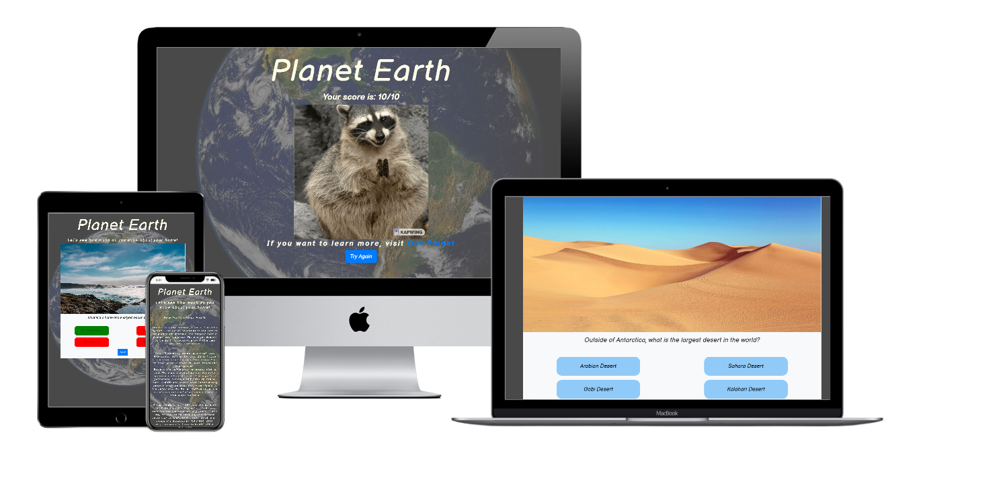
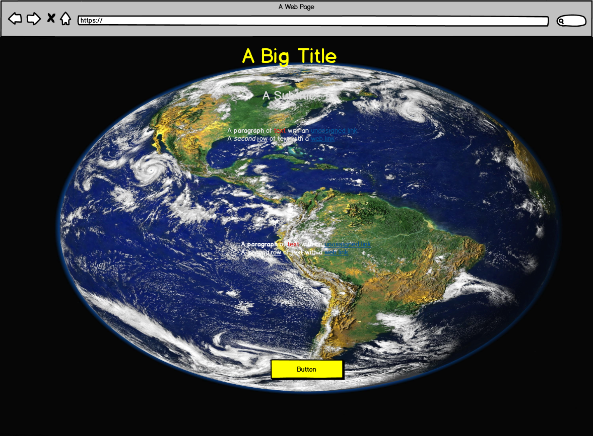
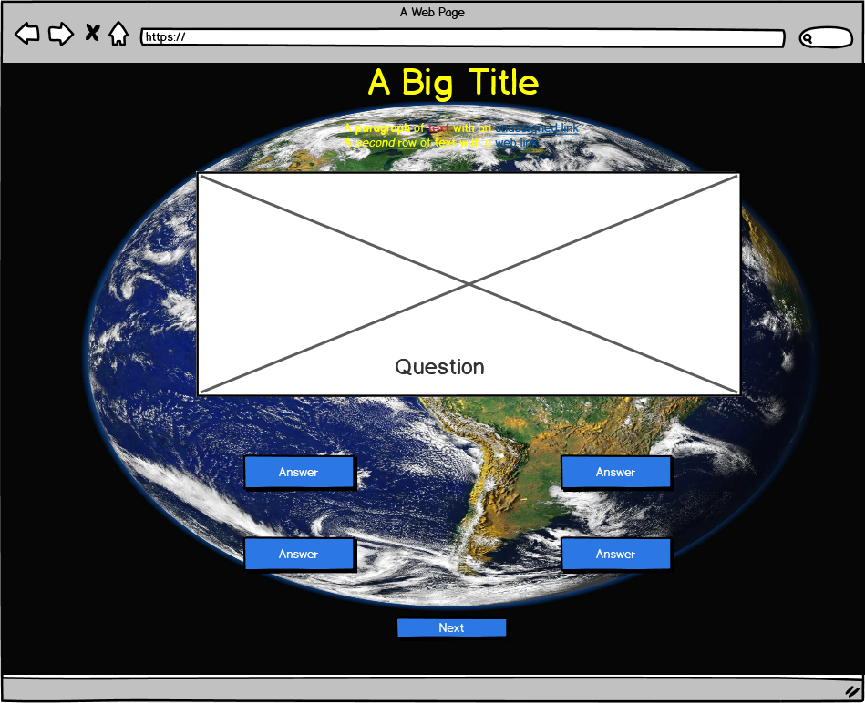
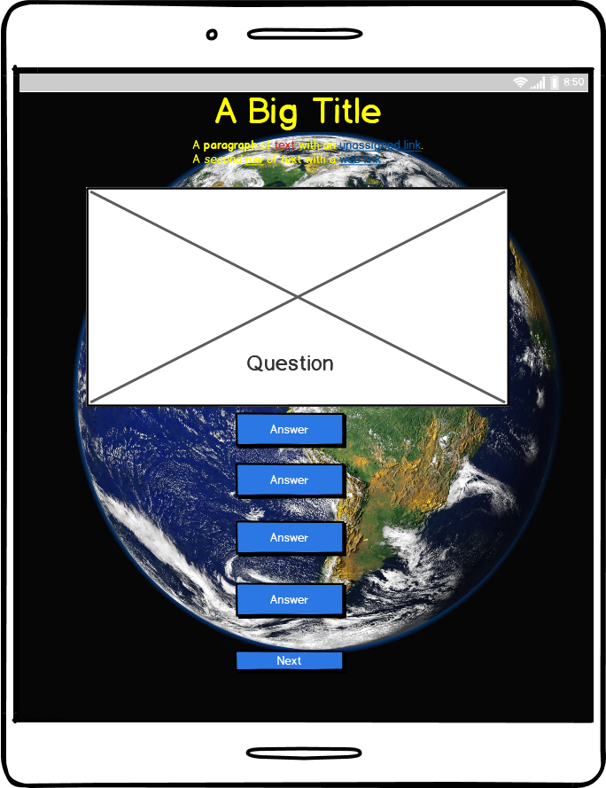
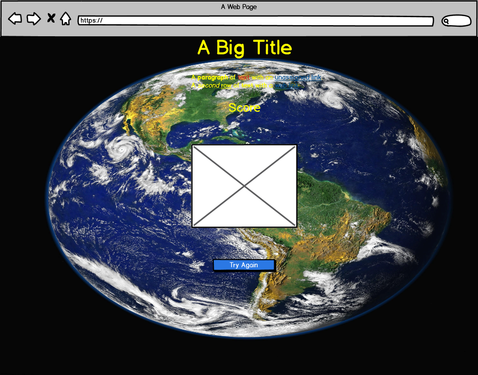

# Earth Quiz

### [Live GitHub Pages Link](https://todorr92.github.io/Earth-Quiz/)
### [GitHub repository Link](https://github.com/todorr92/Earth-Quiz)

## Summary
#### This is a quiz game build to entertain the user, teach something and test the developer's knowledge of JavaScript. The theme of the website is 'Earth', which will be visible in various aspect of the game.
#### The website contains an landing page and the actual quiz game. The result of this project is an interactive frontend website.
## Table of Contents
### 1. UX
### 2. Technologies Applied
### 3. Features
### 4. Tests 
### 5. Deployment
### 6. Credits
## Wireframe Mockups:
#### During the design process I drew up wireframes using [Balsamiq](https://balsamiq.com/)

## Technologies Used:
+ HTML, CSS and JavaScript programming languages
+ [Google Fonts](https://fonts.google.com/) - Balsamiq Sans
+ [Bootstrap](https://getbootstrap.com/) - to easily adapt the website to be responsive for all users
+ [Jquery](https://jquery.com/) - to simplify certin aspects of JavaScript 
+ [Github](https://github.com/) - used to store my repository and record my commits
+ [Gitpod](https://gitpod.io/workspaces/) - used as online IDE
+ [EZGIF.COM](https://ezgif.com/optimize) - used to compress gifs for feedback section
+ [tinyjpg](https://tinyjpg.com/) - used to compress images for better loading time

## Deployment
### This website was deployed using GitHub Pages following steps below:
1. From the menu items near the top of the page, select Settings.
2. Scroll down to the GitHub Pages section.
3. Under Source click the drop-down menu labelled None and select Master Branch
4. On selecting Master Branch the page is automatically refreshed, the website is now deployed.
5. Scroll back down to the GitHub Pages section to retrieve the link to the deployed website.
### Run this project locally
#### Clone this project from GitHub:
1. Under the repository name, click "Clone or download".
2. In the Clone with HTTPs section, copy the clone URL for the repository.
3. In your local IDE open Git Bash.
4. Change the current working directory to the location where you want the cloned directory to be made.
5. Type git clone, and then paste the URL you copied in Step 3.
6. Press Enter. Your local clone will be created.
Click [here](https://docs.github.com/en/github/creating-cloning-and-archiving-repositories/cloning-a-repository) for further reading and troubleshooting on cloning a repository from GitHub.

## Credits

### Content
+ Facts about Earth were taken from [Earth Facts](https://space-facts.com/earth/)
+ Questions were taken from [Earth Quiz](https://www.sciencekids.co.nz/quizzes/earth.html)

### Media
+ The photos used in this site were obtained from [Pexels](https://www.pexels.com/)
+ Feedback Gifs were obtained from [GIFER](https://gifer.com/en)

### Code Credits
+ [Web Dev Simplified](https://www.youtube.com/channel/UCFbNIlppjAuEX4znoulh0Cw) - Build A Quiz App With JavaScript
+ [VerkkoNet](https://www.youtube.com/channel/UCErON4Z0YyiVHKNtx4BvLfg) - Quiz Application in JS 
+ [James Q Quick](https://www.youtube.com/channel/UC-T8W79DN6PBnzomelvqJYw) - Build a Quiz App
+ Other helpful resources were [w3schools.com](), [CSS Gradient](), [Stack Overflow](), [Color Tools](), [MDN web docs](developer.mozilla.org) and [Stack Abuse](stackabuse.com)

### Acknowledgements
#### I would like to thank my mentor, Akshat Garg for his support, insights and advices. 
#### I would also like to thank Slack community for help provided when needed.
## Disclaimer
#### Please note that content on this website is educational purpose only